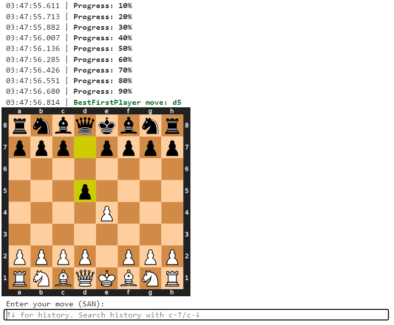

# chess-py
Chess AI written in Python

## About
This is my attempt to create a program that plays chess.

The most interesting thing for me was to develop a strategy for choosing the best move. Therefore, I designed an algorithm for position estimation and several procedures of the game tree analysis.

The implementation of chess rules (storing position, generating moves, etc.) was not so interesting, so I used the ready-made [python-chess](https://python-chess.readthedocs.io/) library.

The user interface was not within the scope of the project at all. The program has a text interface for input/output of moves. You can play, for example, by placing a physical board next to the computer.

#### What for
Just for fun. I like both chess and programming. Therefore, my natural desire was to write a program that plays chess.

## How to run

To run the chess programm you should have some modules installed (the main is [python-chess](https://python-chess.readthedocs.io/)).

To play with the program you can run `main.py`. Enter your moves and read computer's responses in [SAN notation](https://en.wikipedia.org/wiki/Algebraic_notation_(chess)). Also the program prints ASCII board representation. It looks like below:


Or you can use the following code in Jupyter Notebook:

```Python
from main import play
from human_player import HumanPlayer
from best_first_player import BestFirstPlayer

play(HumanPlayer(), BestFirstPlayer(3000), print_svg=True)
```

This gives much nicer output:



## File structure
There are following code files

* `main.py` contains the entry point to start the game.
* `basic_logic.py` contains basic logic of position evaluation.
* `*_player.py` files contain different high-level logic of choosing best move. Work speed and play quality vary. 

## Why Python
I really enjoy using [python-chess](https://python-chess.readthedocs.io/) library, because it is well documented and easy to use. It has a lot of additional features besides basic storing position and generating moves:
* Saving/loading board state in [FEN format](https://en.wikipedia.org/wiki/Forsyth%E2%80%93Edwards_Notation).
* Generate SVG.
* Support different formats of moves notation.
* And many other features...

The high speed of development in Python is also a big advantage. Because I didn't know exactly what the algorithm would be and had to check different ideas and hypothesis.

The main disadvantage of language and library I've chosen is low runtime performance. But it forces me to search for some high-level algorithm optimization. Anyway, game tree size grows exponentially with increasing depth, and if an AI cannot find good move in let's say five seconds, chances it will find in one minute are not high too.

## How it works
Perhaps, the most challenging in developing chess AI is to create good position evaluating function.

Tipically position score is based on:
1. Material balance (weighet sum of white and black pieces of different kinds).
2. Secondary factors (piece locations, pawn structure, etc).

Based on my experience, the first point is more important. If you consider secondary factors too much, the AI starts sacrificing pieces for minor position  improvement and ends up running out of material.

So, calculating the material balance is important. But just summing costs of pieces standing on the board is not enough. Some piece can be under attack and be captured with the next move. But it can also be protected... The essential function of the whole project was written to resolve this problem: detect if piece is in safety, or it will be captured. Let me duplicate the code of this function here:
```Python
# basic_logic.py

def calc_change(board, square):
    moves = [m for m in board.legal_moves if m.to_square == square]
    if len(moves) == 0:
        return 0
    min_cost = min(PIECE_COSTS[board.piece_type_at(m.from_square)] for m in moves)
    moves = [m for m in moves if PIECE_COSTS[board.piece_type_at(m.from_square)] == min_cost]
    balance = PIECE_COSTS[board.piece_type_at(square)]
    board.push(random.choice(moves))
    balance -= calc_change(board, square)
    board.pop()
    return max(0, balance)
```

This method takes a board with some position and a square. It returns how much material current turn player will win, if he captures the piece at the given square. This method has linear (not exponential) complexity because it uses greedy strategy of change estimation instead of complete brute-force of all possible moves:
* Consider only captures at the given square.
* If can capture by different pieces, choose one with the lowest cost.
* Capture is not necessary (that's why there is `max(0, balance)` in the end).

`calc_change` is intensively used in `eval_board` function, which in turn is used in different high-level algorithms in `*_player.py` files.

<!--## Examples of games-->
